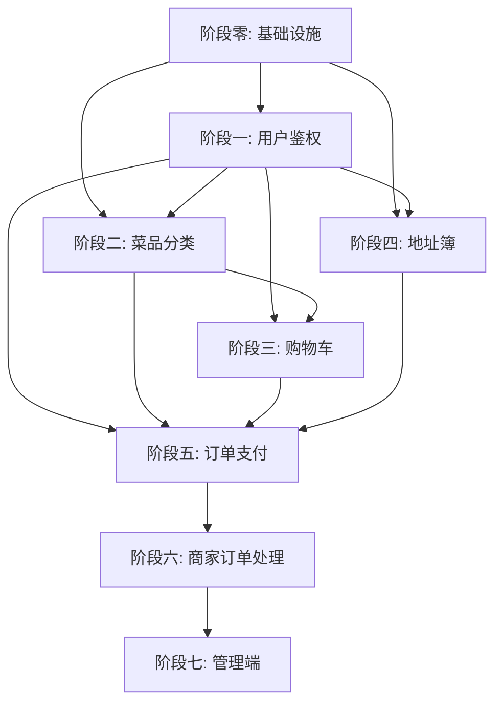

# TakeAwayPlatform 后端开发计划

> **基于文档**：《需求说明书》v1.0 + 《设计说明书》v1.0  
> **项目范围**：仅后端 API 服务开发，不涉及前端  
> **技术框架**：C++17 + cpp-httplib + MySQL Connector/C++ + jsoncpp  
> **生成日期**：2026年7月8日

---

## 目录

1. [现有代码分析与改造清单](#一现有代码分析与改造清单)
2. [阶段零：基础设施准备（数据库 & 框架增强）](#二阶段零基础设施准备数据库--框架增强)
3. [阶段一：用户与鉴权模块](#三阶段一用户与鉴权模块)
4. [阶段二：菜品与分类模块](#四阶段二菜品与分类模块)
5. [阶段三：购物车模块](#五阶段三购物车模块)
6. [阶段四：地址簿模块](#六阶段四地址簿模块)
7. [阶段五：订单与支付模块](#七阶段五订单与支付模块)
8. [阶段六：商家端订单处理模块](#八阶段六商家端订单处理模块)
9. [阶段七：管理端模块（可选）](#九阶段七管理端模块可选)
10. [附录：API 接口汇总表](#十附录api-接口汇总表)

---

## 一、现有代码分析与改造清单

在开始新功能开发之前，必须对老师提供的现有代码进行以下改造。这些改造是后续所有阶段的**前置依赖**。

### 1.1 现有代码问题识别

| 序号 | 文件 | 问题描述 | 影响 |
|------|------|----------|------|
| 1 | `src/http/rest_server.cpp` L507-521 | `/menu` 路由 Lambda 中使用 `[&res]` 按引用捕获 Response 对象，但 `threadPool.enqueue` 是异步的——Lambda 返回后 res 可能已被销毁，导致**悬空引用崩溃** | 🔴 严重Bug |
| 2 | `src/http/rest_server.cpp` L544-639 | `/order` 路由使用 `packaged_task` + `future.get()` 在 HTTP 处理线程中**同步阻塞等待**，完全违背了线程池异步化的设计初衷 | 🟡 设计缺陷 |
| 3 | `src/http/rest_server.cpp` L183-639 | `setup_routes()` 中 `/menu` 和 `/order` 仅为示例路由，查询的表名(`menu_items`)和字段(`user_name`, `order_id`)与实际需求不符 | 🔴 需全部替换 |
| 4 | `src/database/db_handler.cpp` L57-115 | `query()` 方法仅支持 SELECT 查询，缺少 `execute()` 方法支持 INSERT/UPDATE/DELETE | 🔴 功能缺失 |
| 5 | `src/database/db_handler.cpp` | 全部使用字符串拼接 SQL，无预编译语句（PreparedStatement）支持，存在 SQL 注入风险 | 🟡 安全风险 |
| 6 | `src/database/db_handler.h` | 无事务支持（BEGIN/COMMIT/ROLLBACK），订单模块的原子性操作无法实现 | 🔴 功能缺失 |
| 7 | `include/common.h` | `DBConfig` 缺少 JWT 密钥等配置项，配置结构体不完整 | 🟡 扩展性不足 |
| 8 | `src/http/rest_server.cpp` | 无统一的 JSON 响应格式，各路由返回格式不一致 | 🟡 规范化问题 |
| 9 | `CMakeLists.txt` L167-171 | `file(GLOB_RECURSE SOURCES ...)` 只收集了 `src/*.cpp` 和 `src/utils/*.cpp`，新增子目录（如 `src/services/`、`src/middleware/`）的源文件不会被自动编译 | 🟡 构建问题 |
| 10 | `src/main.cpp` L239 | 配置文件路径硬编码为 `/opt/TakeAwayPlatform/config/config.json`，开发调试不便 | 🟡 可用性问题 |

### 1.2 必须完成的预改造任务

#### 改造 1：修复 `rest_server.cpp` 异步处理 Bug

**文件**：`src/http/rest_server.cpp`

**修改思路**：
- 删除第492-522行 `/menu` 路由和第544-639行 `/order` 路由的全部示例代码
- 建立统一的异步请求处理模式：使用 `std::shared_ptr<httplib::Response>` 延长 Response 对象的生命周期
- 所有需要线程池处理的请求，改造为：`auto res_ptr = std::make_shared<httplib::Response>(std::move(res));` 然后在线程池 Lambda 中通过 `res_ptr` 设置响应
- 将 `parse_json()` 方法提升为公共方法，供业务模块复用

#### 改造 2：增强 DatabaseHandler（核心改造）

**文件**：`src/database/db_handler.h`、`src/database/db_handler.cpp`

**新增方法**：

| 方法 | 签名 | 功能 |
|------|------|------|
| `execute` | `int execute(const std::string& sql)` | 执行 INSERT/UPDATE/DELETE，返回影响行数 |
| `executePrepared` | `int executePrepared(const std::string& sql, const std::vector<std::any>& params)` | 执行带参数的预编译 SQL，防止注入 |
| `queryPrepared` | `Json::Value queryPrepared(const std::string& sql, const std::vector<std::any>& params)` | 执行带参数的预编译 SELECT 查询 |
| `beginTransaction` | `void beginTransaction()` | 开启事务（设置 autocommit=0） |
| `commit` | `void commit()` | 提交事务 |
| `rollback` | `void rollback()` | 回滚事务 |
| `getLastInsertId` | `int64_t getLastInsertId()` | 获取最后插入的自增 ID |

**实现思路**：
- `execute()` 使用 `stmt->executeUpdate(sql)` 替代 `executeQuery`
- `executePrepared()` 使用 `connection->prepareStatement(sql)` 获取 `PreparedStatement`，然后根据参数类型依次调用 `setString()`、`setInt()`、`setDouble()` 等设置参数，最后调用 `executeUpdate()`
- `queryPrepared()` 同理但使用 `executeQuery()` 获取结果集
- 事务方法直接调用 `connection->setAutoCommit(false/true)` 和 `connection->commit()`/`rollback()`

#### 改造 3：统一 JSON 响应格式

**文件**：新建 `src/utils/response_utils.h`（header-only）

**设计思路**：
- 定义统一的响应结构：
  ```json
  {
    "code": 200,        // 业务状态码
    "message": "success", // 提示信息
    "data": {}           // 响应数据
  }
  ```
- 提供工具函数：`success_response(data)`、`error_response(code, message)`
- 所有 API 路由统一使用此格式返回

#### 改造 4：配置文件扩展

**文件**：`config/config.json`、`include/common.h`

**新增配置项**：
```json
{
  "jwt": {
    "secret": "your-secret-key-change-in-production",
    "expire_hours": 24
  }
}
```

**修改 `common.h`**：新增 `JwtConfig` 结构体，包含 `secret` 和 `expire_hours` 字段。

#### 改造 5：CMakeLists.txt 构建路径修正

**文件**：`CMakeLists.txt`

**修改思路**：
- 将 `file(GLOB_RECURSE SOURCES ...)` 改为递归收集 `src/` 下所有 `.cpp` 和 `.h` 文件
- 新增 `include_directories` 路径以覆盖新增的业务服务目录
- 如果需要使用 JWT 库（如 jwt-cpp），添加对应的链接配置

#### 改造 6：main.cpp 配置路径优化

**文件**：`src/main.cpp`

**修改思路**：
- 支持通过命令行参数传入配置文件路径：`./TakeAwayPlatform [config_path]`
- 未传入时使用默认路径 `/opt/TakeAwayPlatform/config/config.json`
- 启动时打印所有已注册的路由列表（便于调试）

---

## 二、阶段零：基础设施准备（数据库 & 框架增强）

> **依赖关系**：本阶段是**所有后续阶段的强制前置**，必须最先完成。  
> **预计工作量**：2-3天

### 2.1 任务概述

完成"1.2 必须完成的预改造任务"中列出的所有改造项，为后续业务开发打下坚实基础。

### 2.2 涉及文件清单

| 文件 | 操作 | 说明 |
|------|------|------|
| `src/database/db_handler.h` | **修改** | 新增 execute/事务/预编译方法声明 |
| `src/database/db_handler.cpp` | **修改** | 实现新增方法 |
| `src/http/rest_server.h` | **修改** | 新增公共方法声明 |
| `src/http/rest_server.cpp` | **修改** | 删除示例路由，建立新异步模式 |
| `include/common.h` | **修改** | 新增 JwtConfig 结构体 |
| `config/config.json` | **修改** | 新增 JWT 配置项 |
| `CMakeLists.txt` | **修改** | 修正源文件收集和路径配置 |
| `src/main.cpp` | **修改** | 支持命令行参数 |
| `src/utils/response_utils.h` | **新建** | 统一响应格式工具 |

### 2.3 数据库初始化 SQL

**文件**：新建 `docs/database_init.sql`

需要创建以下数据表（详见设计说明书 7.5 数据字典）：

| 表名 | 说明 | 关键字段 |
|------|------|----------|
| `user` | 用户表 | id, username, password_hash, phone, role, create_time |
| `merchant` | 商家表 | id, user_id(FK), name, announcement, business_hours, status |
| `category` | 菜品分类表 | id, merchant_id(FK), name, sort_weight |
| `dish` | 菜品表 | id, merchant_id(FK), category_id(FK), name, image, description, price, stock, status, create_time |
| `cart` | 购物车表 | id, user_id(FK), total_price |
| `cart_item` | 购物车明细表 | id, cart_id(FK), dish_id(FK), quantity, dish_price |
| `address` | 地址簿表 | id, user_id(FK), name, phone, province, city, district, detail, is_default |
| `order` | 订单表 | id, user_id(FK), address_snapshot(JSON), total_amount, status, create_time, pay_time, accept_time, complete_time |
| `order_item` | 订单明细表 | id, order_id(FK), dish_id, dish_name, dish_price, quantity |

> **重要约定**：
> - 所有金额字段使用 `DECIMAL(10,2)`，严禁 FLOAT/DOUBLE
> - 状态字段使用 `TINYINT`（如 0=待支付, 1=待接单, 2=配送中, 3=已完成, 4=已取消）
> - 时间字段使用 `DATETIME`
> - 存储引擎使用 `InnoDB`
> - 外键约束：order.user_id → user.id, cart_item.dish_id → dish.id 等

### 2.4 测试方案

此阶段主要验证框架能力，无需 Postman 测试。验证内容：

1. **编译通过**：`cd build && cmake .. && make` 无错误
2. **程序启动**：`./TakeAwayPlatform` 正常启动，日志输出正确
3. **数据库连接**：启动日志显示"Database connection successful"
4. **健康检查**：`curl http://localhost:9090/health` 返回 `OK`
5. **预编译查询测试**：编写临时路由调用 `queryPrepared` 验证正常返回

---

## 三、阶段一：用户与鉴权模块

> **依赖关系**：依赖阶段零完成。本阶段是阶段二~七的**前置依赖**（鉴权中间件被所有后续 API 使用）。  
> **预计工作量**：2天

### 3.1 功能概述

实现用户注册、登录鉴权和个人信息管理，采用 JWT Token 结合 RBAC 模型进行身份认证和权限控制。

### 3.2 涉及文件清单

| 文件 | 操作 | 说明 |
|------|------|------|
| `src/middleware/auth_middleware.h` | **新建** | JWT 鉴权中间件（header-only） |
| `src/services/user_service.h` | **新建** | 用户业务服务类声明 |
| `src/services/user_service.cpp` | **新建** | 用户业务逻辑实现 |
| `src/http/rest_server.cpp` | **修改** | 在 `setup_routes()` 中注册用户相关路由 |
| `src/utils/password_utils.h` | **新建** | 密码哈希工具（Bcrypt/SHA-256） |

### 3.3 各文件实现思路

#### 3.3.1 `src/middleware/auth_middleware.h`（鉴权中间件）

**核心设计**：
- 实现一个 `AuthMiddleware` 类，提供静态方法 `authenticate(Request, Response) -> bool`
- 从请求头 `Authorization: Bearer <token>` 中提取 Token
- 解析 JWT Token，验证签名和过期时间
- 解析出 `user_id` 和 `role`，注入到 Request 对象（可通过 httplib 的 `req.set_header()` 或自定义扩展字段）
- 验证失败时直接设置 401 响应并返回 false，调用方检查返回值决定是否继续处理业务
- 提供 `requireRole(Request, Response, role)` 用于 RBAC 权限校验

**JWT 实现选项**：
- **方案A（推荐）**：使用 header-only 的 [jwt-cpp](https://github.com/Thalhammer/jwt-cpp) 库，将头文件放入 `lib/jwt-cpp/`，在 CMakeLists.txt 添加 include 路径
- **方案B**：手动实现简化版 JWT（Base64 + HMAC-SHA256），减少外部依赖

#### 3.3.2 `src/utils/password_utils.h`（密码工具）

**核心设计**：
- 提供 `hashPassword(const std::string& plain) -> std::string`：使用 SHA-256 加盐哈希
- 提供 `verifyPassword(const std::string& plain, const std::string& hash) -> bool`：验证密码
- 盐值随机生成，与哈希结果一起存储（格式：`salt$hash`）
- 若引入 Bcrypt 库更好，但 SHA-256 盐哈希也能满足实训要求

#### 3.3.3 `src/services/user_service.h/cpp`（用户服务）

**类设计**：
```cpp
class UserService {
public:
    UserService(std::function<std::unique_ptr<DatabaseHandler>()> acquireDb);
    
    Json::Value registerUser(const std::string& username, const std::string& password, 
                              const std::string& phone, int role);
    Json::Value login(const std::string& username, const std::string& password);
    Json::Value getProfile(int userId);
    Json::Value updateProfile(int userId, const Json::Value& updates);
    
private:
    std::function<std::unique_ptr<DatabaseHandler>()> acquireDb_;  // 依赖注入获取DB连接
    std::string generateToken(int userId, int role);               // 生成JWT
};
```

**各方法业务逻辑**：

1. **`registerUser()`**：
   - 校验用户名是否已存在（`SELECT COUNT(*) FROM user WHERE username = ?`）
   - 对密码进行加盐哈希
   - 插入用户记录（`INSERT INTO user (username, password_hash, phone, role) VALUES (?, ?, ?, ?)`）
   - 返回新用户信息（不含密码）

2. **`login()`**：
   - 查询用户（`SELECT id, username, password_hash, role FROM user WHERE username = ?`）
   - 验证密码哈希
   - 生成 JWT Token（包含 user_id、role、过期时间）
   - 返回 Token 和用户基本信息

3. **`getProfile()`**：查询并返回用户信息（不返回密码字段）

4. **`updateProfile()`**：更新用户昵称、手机号等字段

#### 3.3.4 `src/http/rest_server.cpp`（路由注册）

在 `setup_routes()` 中新增以下路由：

| 方法 | 路径 | 处理逻辑 |
|------|------|----------|
| POST | `/api/user/register` | 解析 JSON body → 调用 userService.registerUser() → 返回统一响应 |
| POST | `/api/user/login` | 解析 JSON body → 调用 userService.login() → 返回统一响应（含Token） |
| GET | `/api/user/profile` | AuthMiddleware 鉴权 → 调用 userService.getProfile() → 返回用户信息 |
| PUT | `/api/user/profile` | AuthMiddleware 鉴权 → 解析 JSON body → 调用 userService.updateProfile() |

### 3.4 Postman 测试方案

#### 测试 1：用户注册

| 项目 | 内容 |
|------|------|
| **Method** | POST |
| **URL** | `http://localhost:9090/api/user/register` |
| **Headers** | `Content-Type: application/json` |
| **Body (raw JSON)** | `{"username": "test001", "password": "123456", "phone": "13800138000", "role": 0}` |
| **预期成功响应** | `{"code":200, "message":"注册成功", "data":{"id":1, "username":"test001"}}` |
| **预期失败-重复注册** | `{"code":400, "message":"用户名已存在", "data":null}` |

#### 测试 2：用户登录

| 项目 | 内容 |
|------|------|
| **Method** | POST |
| **URL** | `http://localhost:9090/api/user/login` |
| **Body (raw JSON)** | `{"username": "test001", "password": "123456"}` |
| **预期成功响应** | `{"code":200, "message":"登录成功", "data":{"token":"eyJ...", "user":{"id":1, "username":"test001", "role":0}}}` |
| **预期失败-密码错误** | `{"code":401, "message":"用户名或密码错误", "data":null}` |

#### 测试 3：获取个人信息（需鉴权）

| 项目 | 内容 |
|------|------|
| **Method** | GET |
| **URL** | `http://localhost:9090/api/user/profile` |
| **Headers** | `Authorization: Bearer <从登录接口获取的token>` |
| **预期成功响应** | `{"code":200, "data":{"id":1, "username":"test001", "phone":"13800138000"}}` |
| **预期失败-无Token** | `{"code":401, "message":"未提供认证令牌"}` |

#### 测试 4：修改个人信息

| 项目 | 内容 |
|------|------|
| **Method** | PUT |
| **URL** | `http://localhost:9090/api/user/profile` |
| **Headers** | `Authorization: Bearer <token>` |
| **Body** | `{"phone": "13900139000"}` |
| **预期成功响应** | `{"code":200, "message":"更新成功"}` |

> **Postman 使用技巧**：在登录接口的 Tests 标签中设置环境变量：
> ```javascript
> var jsonData = pm.response.json();
> if (jsonData.code === 200) {
>     pm.environment.set("token", jsonData.data.token);
> }
> ```
> 后续接口的 Authorization 标签选择 "Bearer Token"，值设为 `{{token}}`。

---

## 四、阶段二：菜品与分类模块

> **依赖关系**：依赖阶段零、阶段一（鉴权中间件）。  
> **预计工作量**：2天

### 4.1 功能概述

- **用户端**：菜品搜索/筛选/分页查询、获取菜品分类列表
- **商家端**：菜品分类管理（CRUD）、菜品信息管理（CRUD）、菜品上下架控制

### 4.2 涉及文件清单

| 文件 | 操作 | 说明 |
|------|------|------|
| `src/services/dish_service.h` | **新建** | 菜品服务类声明 |
| `src/services/dish_service.cpp` | **新建** | 菜品业务逻辑实现 |
| `src/services/category_service.h` | **新建** | 分类服务类声明 |
| `src/services/category_service.cpp` | **新建** | 分类业务逻辑实现 |
| `src/http/rest_server.cpp` | **修改** | 注册菜品和分类路由 |

### 4.3 各文件实现思路

#### 4.3.1 `dish_service.h/cpp`（菜品服务）

**类结构**：
```cpp
class DishService {
public:
    // 用户端接口
    Json::Value searchDishes(std::optional<int> categoryId, std::optional<std::string> keyword,
                              int page, int pageSize);
    Json::Value getDishDetail(int dishId);
    
    // 商家端接口（需商家身份验证）
    Json::Value addDish(int merchantId, const Json::Value& dishData);
    Json::Value updateDish(int dishId, int merchantId, const Json::Value& dishData);
    Json::Value setDishStatus(int dishId, int merchantId, int status);  // 上下架
    Json::Value deleteDish(int dishId, int merchantId);
    Json::Value getMerchantDishes(int merchantId, std::optional<int> categoryId, int page, int pageSize);
};
```

**关键业务逻辑**：

1. **`searchDishes()`**（设计说明书 6.3.4 算法）：
   - 动态构建 SQL 查询条件（使用 `std::stringstream`）：
     ```sql
     SELECT d.*, m.name as merchant_name, c.name as category_name
     FROM dish d
     JOIN merchant m ON d.merchant_id = m.id
     JOIN category c ON d.category_id = c.id
     WHERE d.status = 1  -- 仅上架菜品
     ```
   - 根据可选参数动态追加 `AND category_id = ?`、`AND d.name LIKE ?`
   - 添加排序和分页：`ORDER BY d.sort_weight DESC, d.create_time DESC LIMIT ? OFFSET ?`
   - 使用 `queryPrepared()` 防止 SQL 注入
   - 返回菜品列表 + 分页信息（total, page, pageSize）

2. **`addDish()`**：校验价格 > 0、分类存在 → INSERT 入库 → 返回新增菜品 ID

3. **`setDishStatus()`**（上下架）：
   - 先查询菜品归属（防止商家A修改商家B的菜品）：`SELECT merchant_id FROM dish WHERE id = ?`
   - 校验 `merchant_id` 匹配后执行 `UPDATE dish SET status = ? WHERE id = ?`

4. **`updateDish()`**：类似上架，先校验归属再更新

#### 4.3.2 `category_service.h/cpp`（分类服务）

**关键业务逻辑**：
- 商家新增分类时，校验同一商家下分类名不重复
- 分类支持排序权重（sort_weight），便于前端按权重排序展示
- 用户端获取分类时，只返回有上架菜品的分类

### 4.4 Postman 测试方案

#### 测试 1：搜索菜品（用户端）

| 项目 | 内容 |
|------|------|
| **Method** | GET |
| **URL** | `http://localhost:9090/api/dishes?keyword=鸡&categoryId=1&page=1&pageSize=10` |
| **Headers** | `Authorization: Bearer {{token}}` |
| **预期成功响应** | `{"code":200, "data":{"list":[...], "total":5, "page":1, "pageSize":10}}` |

#### 测试 2：商家新增菜品

| 项目 | 内容 |
|------|------|
| **Method** | POST |
| **URL** | `http://localhost:9090/api/merchant/dishes` |
| **Headers** | `Authorization: Bearer <商家Token>` |
| **Body** | `{"name": "宫保鸡丁", "price": 28.00, "categoryId": 1, "description": "经典川菜", "image": "/images/gongbao.jpg", "stock": 100}` |
| **预期成功** | `{"code":200, "message":"新增成功", "data":{"dishId":1}}` |

#### 测试 3：菜品上下架

| 项目 | 内容 |
|------|------|
| **Method** | PATCH |
| **URL** | `http://localhost:9090/api/merchant/dishes/1/status` |
| **Headers** | `Authorization: Bearer <商家Token>` |
| **Body** | `{"status": 0}` （0=下架，1=上架） |
| **预期成功** | `{"code":200, "message":"状态更新成功"}` |

#### 测试 4：获取分类列表

| 项目 | 内容 |
|------|------|
| **Method** | GET |
| **URL** | `http://localhost:9090/api/categories?merchantId=1` |
| **预期成功** | `{"code":200, "data":[{"id":1, "name":"热销", "sortWeight":100}, {"id":2, "name":"主食", "sortWeight":90}]}` |

#### 测试 5：权限验证（用户Token无法操作商家接口）

| 项目 | 内容 |
|------|------|
| **Method** | POST |
| **URL** | `http://localhost:9090/api/merchant/dishes` |
| **Headers** | `Authorization: Bearer <普通用户Token>` |
| **预期失败** | `{"code":403, "message":"无权限，需要商家身份"}` |

---

## 五、阶段三：购物车模块

> **依赖关系**：依赖阶段零、一、二（需要菜品信息来加购）。  
> **预计工作量**：1.5天

### 5.1 功能概述

实现用户购物车的增删改查及实时总价计算。数据存储采用 **数据库为主 + 内存计算总价** 的混合策略。

### 5.2 涉及文件清单

| 文件 | 操作 | 说明 |
|------|------|------|
| `src/services/cart_service.h` | **新建** | 购物车服务类声明 |
| `src/services/cart_service.cpp` | **新建** | 购物车业务逻辑实现 |
| `src/http/rest_server.cpp` | **修改** | 注册购物车路由 |

### 5.3 实现思路

#### 5.3.1 数据存储策略

- 购物车采用 **"一用户一购物车"** 模型：`cart` 表存储购物车主记录（含总价），`cart_item` 表存储购物车明细
- 用户首次加购时自动创建 `cart` 记录（`INSERT INTO cart (user_id, total_price) VALUES (?, 0)`）
- 后续加购在 `cart_item` 中插入或更新数量

#### 5.3.2 业务逻辑设计

1. **加购 `addToCart()`**：
   - 获取或创建用户购物车（`SELECT id FROM cart WHERE user_id = ?`）
   - 查询菜品信息：是否上架、当前价格（加购时锁定价格）
   - 检查是否已在购物车中：如果在则 `UPDATE cart_item SET quantity = quantity + ?`；否则 `INSERT INTO cart_item`
   - 触发总价重算

2. **修改数量 `updateQuantity()`**：
   - 校验 cart_item 归属当前用户
   - 更新数量和价格（`UPDATE cart_item SET quantity = ?, dish_price = (SELECT price FROM dish WHERE id = dish_id) WHERE id = ?`）
   - 触发总价重算

3. **移出菜品 `removeItem()`**：
   - 校验归属，删除 cart_item 记录
   - 触发总价重算

4. **总价重算 `recalculateTotal()`**（设计说明书 6.2.4 算法）：
   - 实现为 C++ 内存聚合计算而非 SQL 聚合，减少数据库开销：
   ```cpp
   void recalculateTotal(int cartId) {
       // 查询所有明细
       auto items = queryPrepared("SELECT quantity, dish_price FROM cart_item WHERE cart_id = ?", {cartId});
       double total = 0.0;
       for (auto& item : items) {
           total += item["quantity"].asInt() * item["dish_price"].asDouble();
       }
       // 保留两位小数
       total = std::round(total * 100) / 100.0;
       // 更新主表
       executePrepared("UPDATE cart SET total_price = ? WHERE id = ?", {total, cartId});
   }
   ```

### 5.4 Postman 测试方案

#### 测试 1：添加菜品到购物车

| 项目 | 内容 |
|------|------|
| **Method** | POST |
| **URL** | `http://localhost:9090/api/cart/add` |
| **Headers** | `Authorization: Bearer {{token}}` |
| **Body** | `{"dishId": 1, "quantity": 2}` |
| **预期成功** | `{"code":200, "data":{"cartId":1, "items":[...], "totalPrice":56.00}}` |

#### 测试 2：获取购物车详情

| 项目 | 内容 |
|------|------|
| **Method** | GET |
| **URL** | `http://localhost:9090/api/cart` |
| **Headers** | `Authorization: Bearer {{token}}` |
| **预期成功** | `{"code":200, "data":{"cartId":1, "items":[{"id":1, "dishId":1, "dishName":"宫保鸡丁","quantity":2,"dishPrice":28.00}], "totalPrice":56.00}}` |

#### 测试 3：修改购物车菜品数量

| 项目 | 内容 |
|------|------|
| **Method** | PUT |
| **URL** | `http://localhost:9090/api/cart/item/1` |
| **Body** | `{"quantity": 3}` |
| **预期成功** | `{"code":200, "data":{"totalPrice":84.00}}` |

#### 测试 4：移出购物车菜品

| 项目 | 内容 |
|------|------|
| **Method** | DELETE |
| **URL** | `http://localhost:9090/api/cart/item/1` |
| **预期成功** | `{"code":200, "message":"已移除"}` |

---

## 六、阶段四：地址簿模块

> **依赖关系**：依赖阶段零、一。  
> **预计工作量**：0.5天

### 6.1 功能概述

实现用户配送地址的增删改查（CRUD），支持设置默认地址。

### 6.2 涉及文件清单

| 文件 | 操作 | 说明 |
|------|------|------|
| `src/services/address_service.h` | **新建** | 地址服务类声明 |
| `src/services/address_service.cpp` | **新建** | 地址业务逻辑实现 |
| `src/http/rest_server.cpp` | **修改** | 注册地址路由 |

### 6.3 实现思路

- 每个用户可以有多条地址记录
- 设置默认地址时，先将该用户所有地址的 `is_default` 设为 0，再将要设默认的那条设为 1（通过事务保证一致性）
- 所有操作需校验地址归属当前用户（`WHERE user_id = ?`）

### 6.4 Postman 测试方案

#### 测试：地址 CRUD 全流程

| 步骤 | Method | URL | Body | 预期 |
|------|--------|-----|------|------|
| 新增 | POST | `/api/addresses` | `{"name":"张三","phone":"138...","province":"湖北省","city":"武汉市","district":"洪山区","detail":"珞喻路152号","isDefault":true}` | 返回新地址ID |
| 列表 | GET | `/api/addresses` | - | 返回地址列表 |
| 修改 | PUT | `/api/addresses/1` | `{"phone":"139..."}` | 更新成功 |
| 删除 | DELETE | `/api/addresses/1` | - | 删除成功 |
| 设默认 | PUT | `/api/addresses/2/default` | - | 设置成功 |

---

## 七、阶段五：订单与支付模块

> **依赖关系**：依赖阶段零~四（需要鉴权、菜品、购物车、地址）。  
> **这是整个项目的**核心模块**，涉及事务、库存扣减、状态机。  
> **预计工作量**：3天

### 7.1 功能概述

实现订单创建（含库存扣减事务）、模拟支付、订单状态流转、订单查询。

### 7.2 涉及文件清单

| 文件 | 操作 | 说明 |
|------|------|------|
| `src/services/order_service.h` | **新建** | 订单服务类声明 |
| `src/services/order_service.cpp` | **新建** | 订单业务逻辑实现（最复杂） |
| `src/utils/order_state_machine.h` | **新建** | 订单状态机（header-only） |
| `src/http/rest_server.cpp` | **修改** | 注册订单路由 |

### 7.3 各文件实现思路

#### 7.3.1 `src/utils/order_state_machine.h`（订单状态机）

根据设计说明书 6.1.4 的状态转移矩阵实现：

```cpp
enum class OrderStatus {
    PENDING_PAYMENT = 0,   // 待支付
    PENDING_ACCEPTANCE = 1, // 待接单
    DELIVERING = 2,         // 配送中
    COMPLETED = 3,          // 已完成
    CANCELLED = 4           // 已取消
};

class OrderStateMachine {
public:
    // 定义合法的状态转换（key: 当前状态 → value: 允许的目标状态集合）
    static bool isValidTransition(OrderStatus from, OrderStatus to);
    static std::string getStatusName(OrderStatus status);
};
```

合法转换：
- 待支付 → {待接单, 已取消}
- 待接单 → {配送中, 已取消}
- 配送中 → {已完成}
- 已完成 → {} (终态)
- 已取消 → {} (终态)

#### 7.3.2 `order_service.cpp`（订单服务——核心）

**1. 创建订单 `createOrder()`**（设计说明书 6.1.4 库存防超卖算法）：

这是整个项目最复杂的业务逻辑，必须在一个数据库事务中完成以下操作：

```
事务开始 (BEGIN)
├── 1. 查询购物车明细（SELECT * FROM cart_item WHERE cart_id = ?）
├── 2. 校验菜品状态（是否上架、价格是否变动）
├── 3. 锁定库存（SELECT stock FROM dish WHERE id = ? FOR UPDATE）// 悲观锁防超卖
├── 4. 校验库存充足（stock >= quantity）
├── 5. 扣减库存（UPDATE dish SET stock = stock - ? WHERE id = ?）
├── 6. 创建订单主记录（INSERT INTO order ...）
├── 7. 创建订单明细记录（INSERT INTO order_item ... 逐条插入）
├── 8. 清空购物车（DELETE FROM cart_item WHERE cart_id = ?）
├── 9. 更新购物车总价（UPDATE cart SET total_price = 0 WHERE id = ?）
事务提交 (COMMIT)
```

**异常处理**：任一步骤失败 → `ROLLBACK` 回滚所有操作，返回错误信息。

**关键实现点**：
- 第3步使用 `SELECT ... FOR UPDATE` 锁定菜品行，防止并发超卖
- 第5步需要再次判断 `stock >= quantity`（并发场景下锁定后库存可能已变）
- 地址信息以快照形式存入订单（`address_snapshot` JSON字段），防止用户后续修改地址影响历史订单

**2. 模拟支付 `mockPayment()`**：

- 校验订单归属和当前状态（必须是"待支付"）
- 模拟支付结果：可设计为 90% 概率成功 / 10% 概率失败（或前端传入）
- 成功 → 状态流转为"待接单"，记录 `pay_time`
- 失败 → 状态流转为"已取消"，**恢复库存**（UPDATE dish SET stock = stock + ?）

**3. 订单查询**：
- `getUserOrders(userId, status, page, pageSize)`：支持按状态筛选、分页
- `getOrderDetail(orderId)`：返回订单主表 + 明细列表

### 7.4 Postman 测试方案

#### 测试 1：提交订单

| 项目 | 内容 |
|------|------|
| **Method** | POST |
| **URL** | `http://localhost:9090/api/orders` |
| **Headers** | `Authorization: Bearer {{token}}` |
| **Body** | `{"addressId": 1, "cartIds": [1], "remark": "少放辣"}` |
| **预期成功** | `{"code":200, "data":{"orderId":1, "totalPrice":56.00, "status":0, "statusName":"待支付"}}` |
| **预期失败-库存不足** | `{"code":400, "message":"菜品xxx库存不足"}` |

#### 测试 2：模拟支付

| 项目 | 内容 |
|------|------|
| **Method** | POST |
| **URL** | `http://localhost:9090/api/orders/1/pay` |
| **Headers** | `Authorization: Bearer {{token}}` |
| **预期成功** | `{"code":200, "data":{"status":1, "statusName":"待接单"}}` |
| **预期失败-状态不对** | `{"code":400, "message":"当前订单状态不允许支付"}` |

#### 测试 3：查询订单列表

| 项目 | 内容 |
|------|------|
| **Method** | GET |
| **URL** | `http://localhost:9090/api/orders?status=1&page=1&pageSize=10` |
| **预期成功** | `{"code":200, "data":{"list":[...], "total":2}}` |

#### 测试 4：查询订单详情

| 项目 | 内容 |
|------|------|
| **Method** | GET |
| **URL** | `http://localhost:9090/api/orders/1` |
| **预期成功** | `{"code":200, "data":{"order":{...}, "items":[{...}, {...}]}}` |

#### 测试 5：并发下单防超卖（进阶测试）

使用 Postman 的 Collection Runner 或 Apache Bench（ab）进行并发测试：

```bash
# 使用 ab 模拟 50 个并发请求，总共 200 个请求
ab -n 200 -c 50 -p order.json -T application/json \
   -H "Authorization: Bearer <token>" \
   http://localhost:9090/api/orders
```

验证：检查数据库 dish 表的 stock 字段不会变为负数。

---

## 八、阶段六：商家端订单处理模块

> **依赖关系**：依赖阶段五（订单已创建、已支付）。  
> **预计工作量**：1天

### 8.1 功能概述

实现商家查看待处理订单、确认接单、标记配送完成。

### 8.2 涉及文件清单

| 文件 | 操作 | 说明 |
|------|------|------|
| `src/http/rest_server.cpp` | **修改** | 注册商家订单路由 |

> **说明**：商家订单处理逻辑相对简单，可直接在路由处理函数中实现，不一定需要独立的 Service 类。如果代码量增加，可新建 `src/services/merchant_order_service.h/cpp`。

### 8.3 实现思路

1. **查询待处理订单** `GET /api/merchant/orders?status=1`：
   - 先通过当前商家 `user_id` 查询 `merchant_id`
   - 查询该商家菜品相关的待接单订单（需要 JOIN order_item + dish 表）
   - 返回订单列表（含用户信息、菜品明细、下单时间）

2. **确认接单** `PUT /api/merchant/orders/{id}/accept`：
   - 校验订单状态为"待接单"
   - 校验订单中有该商家的菜品
   - 更新状态为"配送中"，记录 `accept_time`
   - 状态机校验

3. **标记完成** `PUT /api/merchant/orders/{id}/complete`：
   - 校验订单状态为"配送中"
   - 更新状态为"已完成"，记录 `complete_time`
   - 状态机校验

### 8.4 Postman 测试方案

#### 测试 1：查看待接单订单

| 项目 | 内容 |
|------|------|
| **Method** | GET |
| **URL** | `http://localhost:9090/api/merchant/orders?status=1` |
| **Headers** | `Authorization: Bearer <商家Token>` |
| **预期成功** | 返回该商家相关的待接单订单列表 |

#### 测试 2：确认接单

| 项目 | 内容 |
|------|------|
| **Method** | PUT |
| **URL** | `http://localhost:9090/api/merchant/orders/1/accept` |
| **Headers** | `Authorization: Bearer <商家Token>` |
| **预期成功** | `{"code":200, "data":{"status":2, "statusName":"配送中"}}` |

#### 测试 3：标记完成

| 项目 | 内容 |
|------|------|
| **Method** | PUT |
| **URL** | `http://localhost:9090/api/merchant/orders/1/complete` |
| **预期成功** | `{"code":200, "data":{"status":3, "statusName":"已完成"}}` |

#### 测试 4：权限校验

| 项目 | 内容 |
|------|------|
| **Method** | PUT |
| **URL** | `http://localhost:9090/api/merchant/orders/1/accept` |
| **Headers** | `Authorization: Bearer <普通用户Token>` |
| **预期失败** | `{"code":403, "message":"无权限"}` |

---

## 九、阶段七：管理端模块（可选）

> **依赖关系**：依赖阶段零~六。  
> **预计工作量**：1.5天

### 9.1 功能概述

- 用户管理：查看用户列表、冻结/解冻账号
- 商家审核：查看商家列表、审核通过/拒绝
- 数据看板：统计今日订单数、交易额、活跃用户数
- 系统配置：配送费规则、抽成比例

### 9.2 实现思路

- 所有管理端接口需要 `role = 2`（管理员）权限
- 数据看板通过 SQL 聚合查询实现（`SELECT COUNT(*), SUM(total_amount) FROM order WHERE DATE(create_time) = CURDATE()`）
- 系统配置可存储在 `system_config` 表中，key-value 结构

### 9.3 Postman 测试要点

- 使用管理员 Token 访问接口
- 使用普通用户/商家 Token 验证 403 返回

---

## 十、附录：API 接口汇总表

### 10.1 完整接口列表

| 阶段 | 方法 | 路径 | 鉴权 | 角色 | 说明 |
|------|------|------|------|------|------|
| 零 | GET | `/` | 无 | - | 服务状态 |
| 零 | GET | `/health` | 无 | - | 健康检查 |
| 一 | POST | `/api/user/register` | 无 | - | 用户注册 |
| 一 | POST | `/api/user/login` | 无 | - | 用户登录 |
| 一 | GET | `/api/user/profile` | Token | 所有 | 获取个人信息 |
| 一 | PUT | `/api/user/profile` | Token | 所有 | 修改个人信息 |
| 二 | GET | `/api/dishes` | Token | 所有 | 搜索/筛选菜品 |
| 二 | GET | `/api/dishes/{id}` | Token | 所有 | 菜品详情 |
| 二 | GET | `/api/categories` | Token | 所有 | 分类列表 |
| 二 | POST | `/api/merchant/dishes` | Token | 商家 | 新增菜品 |
| 二 | PUT | `/api/merchant/dishes/{id}` | Token | 商家 | 修改菜品 |
| 二 | DELETE | `/api/merchant/dishes/{id}` | Token | 商家 | 删除菜品 |
| 二 | PATCH | `/api/merchant/dishes/{id}/status` | Token | 商家 | 上下架 |
| 二 | GET | `/api/merchant/dishes` | Token | 商家 | 商家菜品列表 |
| 二 | POST | `/api/merchant/categories` | Token | 商家 | 新增分类 |
| 二 | PUT | `/api/merchant/categories/{id}` | Token | 商家 | 修改分类 |
| 三 | GET | `/api/cart` | Token | 用户 | 购物车详情 |
| 三 | POST | `/api/cart/add` | Token | 用户 | 加入购物车 |
| 三 | PUT | `/api/cart/item/{id}` | Token | 用户 | 修改数量 |
| 三 | DELETE | `/api/cart/item/{id}` | Token | 用户 | 移出购物车 |
| 四 | GET | `/api/addresses` | Token | 用户 | 地址列表 |
| 四 | POST | `/api/addresses` | Token | 用户 | 新增地址 |
| 四 | PUT | `/api/addresses/{id}` | Token | 用户 | 修改地址 |
| 四 | DELETE | `/api/addresses/{id}` | Token | 用户 | 删除地址 |
| 四 | PUT | `/api/addresses/{id}/default` | Token | 用户 | 设默认地址 |
| 五 | POST | `/api/orders` | Token | 用户 | 提交订单 |
| 五 | POST | `/api/orders/{id}/pay` | Token | 用户 | 模拟支付 |
| 五 | GET | `/api/orders` | Token | 用户 | 订单列表 |
| 五 | GET | `/api/orders/{id}` | Token | 用户 | 订单详情 |
| 六 | GET | `/api/merchant/orders` | Token | 商家 | 待处理订单 |
| 六 | PUT | `/api/merchant/orders/{id}/accept` | Token | 商家 | 确认接单 |
| 六 | PUT | `/api/merchant/orders/{id}/complete` | Token | 商家 | 标记完成 |
| 七 | GET | `/api/admin/users` | Token | 管理员 | 用户列表 |
| 七 | PUT | `/api/admin/users/{id}/status` | Token | 管理员 | 冻结/解冻 |
| 七 | GET | `/api/admin/merchants` | Token | 管理员 | 商家审核列表 |
| 七 | PUT | `/api/admin/merchants/{id}/audit` | Token | 管理员 | 审核商家 |
| 七 | GET | `/api/admin/dashboard` | Token | 管理员 | 数据看板 |
| 七 | GET | `/api/admin/config` | Token | 管理员 | 系统配置 |
| 七 | PUT | `/api/admin/config` | Token | 管理员 | 修改配置 |

### 10.2 项目目录结构（开发完成后）

```
~/TakeAwayPlatform/
├── CMakeLists.txt
├── config/
│   └── config.json
├── docs/
│   ├── 后端开发计划.md          ← 本文件
│   └── database_init.sql        ← 数据库建表脚本
├── include/
│   ├── common.h                 ← [已修改] 新增 JwtConfig 等
│   ├── log.h
│   ├── task_queue.h
│   └── thread_pool.h
├── lib/
│   ├── cpp-httplib/
│   ├── jsoncpp/
│   ├── mysql-connector/
│   └── jwt-cpp/                 ← [新增] JWT 库
├── shell/
├── src/
│   ├── main.cpp                 ← [已修改] 支持命令行参数
│   ├── database/
│   │   ├── db_handler.h         ← [已修改] 新增事务/预编译方法
│   │   └── db_handler.cpp       ← [已修改]
│   ├── http/
│   │   ├── rest_server.h        ← [已修改]
│   │   └── rest_server.cpp      ← [已修改] 新路由+异步模式修复
│   ├── log/
│   │   └── log.cpp
│   ├── middleware/
│   │   └── auth_middleware.h    ← [新增] JWT 鉴权中间件
│   ├── services/
│   │   ├── user_service.h       ← [新增]
│   │   ├── user_service.cpp     ← [新增]
│   │   ├── dish_service.h       ← [新增]
│   │   ├── dish_service.cpp     ← [新增]
│   │   ├── category_service.h   ← [新增]
│   │   ├── category_service.cpp ← [新增]
│   │   ├── cart_service.h       ← [新增]
│   │   ├── cart_service.cpp     ← [新增]
│   │   ├── address_service.h    ← [新增]
│   │   ├── address_service.cpp  ← [新增]
│   │   ├── order_service.h      ← [新增]
│   │   └── order_service.cpp    ← [新增]
│   ├── threading/
│   │   ├── task_queue.cpp
│   │   └── thread_pool.cpp
│   └── utils/
│       ├── json_utils.cpp
│       ├── response_utils.h     ← [新增] 统一响应格式
│       ├── password_utils.h     ← [新增] 密码哈希工具
│       └── order_state_machine.h ← [新增] 订单状态机
└── build/
    └── TakeAwayPlatform
```

### 10.3 开发依赖关系图



### 10.4 开发顺序建议

```
第1-3天：阶段零（基础设施）→ 编译通过，框架就绪
第4-5天：阶段一（用户鉴权）→ 注册登录跑通，Postman 验证
第6-7天：阶段二（菜品分类）→ 菜品 CRUD 完成，搜索筛选用 Postman 验证
第8-9天：阶段三（购物车）   → 加购/改量/计价，Postman 验证
第9天下午：阶段四（地址簿）  → 快速完成，Postman 验证
第10-12天：阶段五（订单支付）→ 核心模块，事务+库存+支付，Postman + ab 并发测试
第13天：阶段六（商家订单）   → 接单/完成，Postman 验证
第14-15天：阶段七（管理端）  → 可选，Postman 验证
```

---

> **文档结束**  
> 开发过程中请严格遵循本计划中的阶段顺序和依赖关系。每个阶段完成后务必使用 Postman 进行全面的接口测试，确保功能正确后再进入下一阶段。
